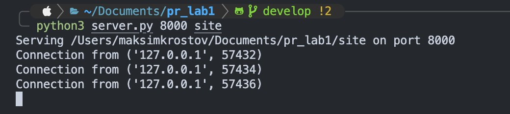
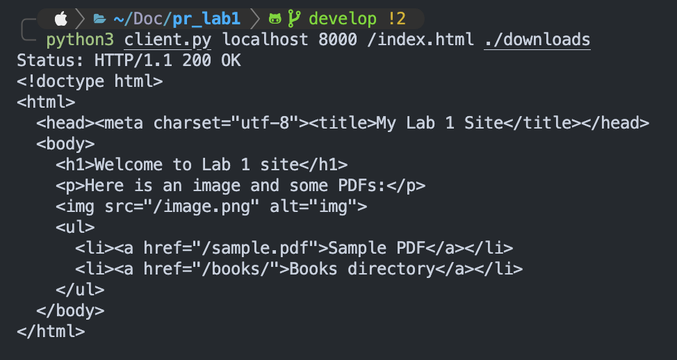

### Laboratory Work №1

**Topic:** Creating a Simple HTTP File Server using TCP sockets
**Student:** Maksim Krostov, FAF-232

---
## 1. Purpose of the Work
The purpose of this lab is to create a simple HTTP file server that operates over raw TCP sockets, capable of:
- Accepting HTTP `GET` requests.
- Serving files of types `.html`, `.png`, `.pdf`.
- Responding with correct HTTP status codes (`200 OK`, `404 Not Found`, etc.).
- Optionally generating a directory listing and supporting a simple client for testing.

---
## 2. Tasks
1. Implement a **server** that:
- Listens for TCP connections and parses HTTP requests.
- Returns correct headers and file contents.
- Supports only `.html`, `.png`, `.pdf` files.
- Generates directory listings for folders.
- Handles incorrect requests with appropriate error codes.

2. Implement a **client** that:
- Sends HTTP `GET` requests.
- Displays HTML or saves binary files (PNG/PDF).

3. Prepare a **site** directory with:
- `index.html` page.
- Example files and nested directories.

1. Create a **Dockerfile** and **docker-compose.yml** for running the server in a container.
---
## 3. Implementation Details

### Server — `server.py`
The server uses **raw TCP sockets** and follows these steps:
1. Opens a socket and listens on a port (e.g., `8000`).
2. Parses the HTTP request line.
3. Supports only the `GET` method (other methods return `405 Method Not Allowed`
4. Sanitizes paths to avoid directory traversal (`../`).
5. Returns:
- **200 OK** — for valid files.
- **404 Not Found** — for missing or forbidden files.
- **301 Moved Permanently** — for directories without a trailing slash.
1. Automatically generates a directory listing in HTML format.
### Client — `client.py`
The client:
- Connects to the server.
- Sends a basic `GET` request.
- Receives and parses the HTTP response.
- Saves images and PDFs to disk; displays HTML in console.

---
## 4. Example Run
### Start the server
```bash

python3 server.py 8000 site

````

Output example:
```

Serving /path/to/site on port 8000

Connection from ('127.0.0.1', 54321)

```
  
### Open in browser

Go to [http://localhost:8000/](http://localhost:8000/)

You should see:
```

Welcome to Lab 1 site

Here is an image and some PDFs

- Sample PDF

- Books directory

```
  
### Tes 404
Visit:
[http://localhost:8000/notfound](http://localhost:8000/notfound)
Response: **404 Not Found**

### Directory listing  

Visit:
[http://localhost:8000/books/](http://localhost:8000/books/)
Displays list of files: `book1.pdf`, `cover.png`.

### Using the client
```bash

python3 client.py localhost 8000 /sample.pdf ./downloads

```

Output:
```

Status: HTTP/1.1 200 OK

Saved to ./downloads/sample.pdf

```

---
## 5. Running in Docker

  

### Build and run

```bash

docker-compose up --build

```

After the build:
* The server starts on port `8000`.
* Access it via browser at [http://localhost:8000](http://localhost:8000)
---
## 6. Example Output (Server Console)


---
## 7. Example Output (Client Console)
  

---

## 8. Example Output (Main menu)
  

---
## 9. Conclusion
During this laboratory work I have:
* Implemented an HTTP server from scratch using **TCP sockets**.
* Learned how HTTP requests and responses are structured.
* Implemented a minimal HTTP **client**.
* Used **Docker** for containerizing the project.
* Tested correct handling of HTML, PNG, and PDF files.

**Result:**
All functional and additional requirements were successfully implemented.
**Laboratory work №1 completed successfully.**

---